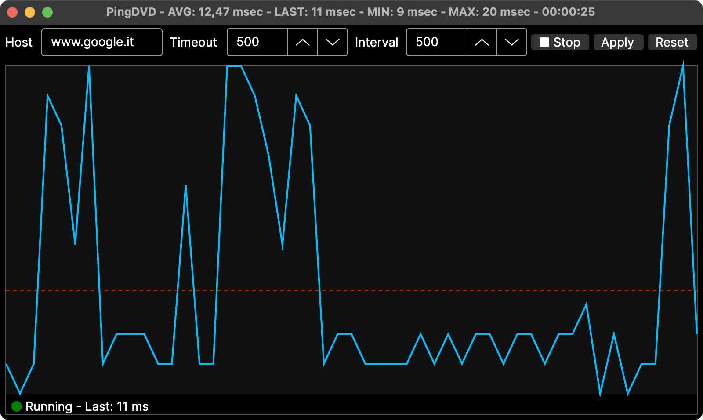

# PingDVD
GUI per il ping con grafico in tempo reale

Applicazione per il monitoraggio della latenza di rete costruita con Avalonia .NET che esegue il ping di un host specificato e visualizza i tempi di risposta in un grafico interattivo.



## Funzionalità

- **Monitoraggio Ping in Tempo Reale**: Esegue continuamente il ping di un host e visualizza la latenza nel tempo
- **Grafico Interattivo**: Polilinea DeepSkyBlue che mostra i tempi di ping con linea media OrangeRed
- **Indicatori di Stato**:
  - Indicatore LED (Rosso/Verde/Arancione) che mostra lo stato corrente
  - Testo di stato che visualizza "Stopped", "Running" o messaggi di errore
  - Posizionato comodamente sotto il grafico
- **Gestione Migliorata degli Errori**:
  - Distingue tra host non raggiungibile, accesso negato e altri errori di ping
  - I codici di errore non entrano nel grafico né nelle statistiche (MIN/AVG/MAX)
  - Fallback grazioso ai valori di timeout per continuare la visualizzazione
- **Controlli Utente**:
  - Campo per l'input dell'host (hostname o indirizzo IP)
  - Timeout configurabile (1-100000 ms)
  - Intervallo configurabile (1-100000 ms)
  - Pulsante Start/Stop per controllare le operazioni di ping
  - Pulsante Apply per salvare immediatamente le impostazioni
  - Pulsante Reset per ripristinare i valori predefiniti
- **Persistenza delle Impostazioni**:
  - Salvataggio automatico delle impostazioni alla chiusura dell'applicazione
  - Salvataggio manuale tramite pulsante Apply
  - Caricamento delle impostazioni salvate all'avvio
  - File `pingdvd.settings.json` accanto all'eseguibile, con fallback automatico nella cartella utente (`ApplicationData`) se la directory di installazione è di sola lettura
- **Statistiche Accurate**:
  - All'avvio di una sessione i campioni sintetici di esempio vengono rimossi: AVG/MIN/MAX riflettono solo ping reali
  - Tempo trascorso misurato con cronometro reale (non stimato dall'intervallo)
  - Protezione da loop di ping duplicati in caso di Start/Stop ravvicinati
- **Miglioramenti al Grafico**:
  - Auto-scaling con range Y minimo (10ms) per la leggibilità quando i valori sono simili
  - Dimensione dello storico configurabile (predefinito 500 campioni)
  - Animazione fluida e aggiornamento continuo

## Dettagli Tecnici

- **Framework**: .NET 8.0 con Avalonia UI
- **Multi-piattaforma**: Principalmente testato su macOS, ma progettato per l'uso multi-piattaforma
- **Networking**: Utilizza la classe System.Net.NetworkInformation.Ping
- **UI**: Pattern ispirato al MVVM con logica nel code-behind
- **Persistenza**: Archiviazione delle impostazioni in formato JSON

## Impostazioni Predefinite

- **Host**: www.google.it
- **Intervallo**: 500 ms
- **Timeout**: 500 ms
- **Dimensione Storico**: 500 campioni
- **Grafico Iniziale**: Pre-popolato con 200 punti di campione per una visualizzazione immediata

## Miglioramenti Recenti

1. **Gestione Migliorata degli Errori**: Differenzia tra vari modi di guasto del ping
2. **Migliorato Feedback UI**: Indicatore LED di stato con messaggi contestuali
3. **Applicazione Immediata delle Impostazioni**: Pulsante Apply salva le impostazioni senza riavvio
4. **Reset con un Clic**: Ripristina istantaneamente i valori predefiniti
5. **Validazione dell'Input**: Validazione base hostname/IP prima dei tentativi di ping
6. **Leggibilità del Grafico**: Range Y minimo previene grafici illeggibili
7. **Qualità del Codice**: I magic numbers sostituiti con costanti denominate, calcoli ottimizzati
8. **Correzione Statistiche**: Codici di errore esclusi da grafico e medie, dati sintetici rimossi allo Start, tempo trascorso reale
9. **Stabilità**: Nessun loop di ping duplicato su Start/Stop ravvicinati, nessun aggiornamento UI dopo la chiusura della finestra
10. **Bundle macOS**: Release distribuita come `PingDVD.app` con icona nel Dock e nome "Ping DVD" nella barra menu

## Istruzioni per l'Uso

1. Avviare l'applicazione
2. Opzionalmente modificare i valori di Host, Timeout e Intervallo
3. Fare clic su "Start" per iniziare il ping
4. Osservare la latenza in tempo reale nel grafico
5. Utilizzare "Apply" per salvare le impostazioni correnti
6. Utilizzare "Reset" per tornare alle impostazioni di fabbrica
7. Fare clic su "Stop" per interrompere il pinging
8. Le impostazioni vengono salvate automaticamente all'uscita

## Come Compilare

```bash
dotnet build
dotnet run
```

### Pubblicazione

```bash
# Windows
dotnet publish PingDVD/PingDVD.csproj -c Release -r win-x64 --self-contained false

# macOS
dotnet publish PingDVD/PingDVD.csproj -c Release -r osx-arm64 --self-contained false
```

Su macOS la release è distribuita come bundle `PingDVD.app` (con icona del Dock e nome "Ping DVD" nella barra menu, definiti in `Info.plist` e `App.axaml`).

## Licenza

Licenza MIT - vedere il file LICENSE per i dettagli.
# CI Status

This project uses GitHub Actions to automatically build Release versions for Windows and macOS on every commit.
